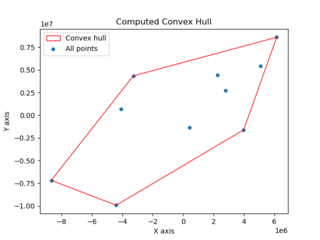
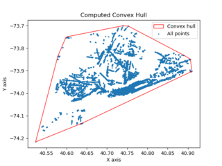

# Convex Hull

## Introduction

Given a set of points P, the Convex Hull of P, denoted conv(P) is the smallest closed
simple polygon which contains all the points in P. It can be visualized as a tightly
snapped rubber band over the given set of points.

We would like to compute the convex hull of given set of points by using a divide and
conquer technique. Later, we will also show that the computational complexity of our 
algorithm is also O(n log n). Note that we cannot do better than is for computing 
convex hull

## How to Run

The src folder contains the source code for the convex hull program. `g++` from the GNU
compiler suite is required to compile the program to a executable.

Steps to Compile:

1) `cd` into the src directory
2) Run `g++ main.cpp` which generates an executable called `a.out` in the same directory
3) Run the executable using `./a.out` (on linux) 
   1) The executable takes a dataset from command line argument. For example, to use an existing dataset, run `./a.out ../datasets/edge.txt`
   2) If no command-line argument is given, it takes input from the shell directly (stdin)

## Input

The required file format for the algorithm to work correctly is:

- First line must contain the no of Points to be taken as input by the program.
- Each of next line must contain 2 integers, space seperated denoting the (x, y) coordinates of each point.
- Each coordinate must be of integer type in the range -10^6 to 10^6.
- No of coordinates must be less than 1 Billion.
- **Note**: while using floating point datasets, the output coordinates might slightly differ as given coordinates are stored as floats.

## Output

Each line of output contains the coordinates of points present on the convex hull in 
clockwise order.  
The last two lines of output show the time taken to take input in microseconds and the 
time taken by the algorithm to compute convex hull (also in microseconds).

Example output: 

{ width=8cm height=8cm }\

## Documentation and Report

Documentation of this algorithm, functions and classes can be found in the `docs` folder 
in the current directory. Open the [index.html](../ConvexHull/docs/html/index.html) file from 
the docs directory with your preferred browser to go through the documentation

## Performance Analysis

Analysis is performed with a system running:

- OS: Arch Linux (64Bit) running Linux Kernel version 5.7.2
- Processor: Intel Core i7 7700HQ
- RAM: 8GB
- Compiler: GNU G++ (GCC) 10.1.0

**The following observations are recorded:**

| Filename   | Input Dimentions | Output Diemntions | File read time | Algorithm runtime |
|:---------  |:----------------:|:-----------------:|:--------------:|:-----------------:|
| edge.txt   | 5                | 4                 | 451 microsec   | 8 microsec        |
| small.txt  | 7                | 7                 | 495 microsec   | 16 microsec       |
| test.txt   | 34               | 7                 | 328 microsec   | 56 microsec       |
| radial.txt | 3100             | 9                 | 1348 microsec  | 6.15 millisec     |

Randomly generated points (using python):

| Filename   | Input Dimentions | Output Diemntions | File read time | Algorithm runtime |
|:---------  |:----------------:|:-----------------:|:--------------:|:-----------------:|
| 10.txt     | 10               | 5                 | 314 microsec   | 16 microsec       |
| 20.txt     | 20               | 7                 | 495 microsec   | 31 microsec       |
| 50.txt     | 50               | 9                 | 427 microsec   | 108 microsec      |
| 100.txt    | 100              | 13                | 348 microsec   | 165 microsec      |
| 500.txt    | 500              | 13                | 572 microsec   | 935 microsec      |
| 1000.txt   | 1000 (1K)        | 18                | 510 microsec   | 2.1 millisec      |
| 3000.txt   | 3000 (3K)        | 24                | 2.49 millisec  | 5.5 millisec      |
| 5000.txt   | 5000 (5K)        | 22                | 2.12 millisec  | 8.0 millisec      |
| 10000.txt  | 10000 (10K)      | 23                | 3.26 millisec  | 17.6 millisec     |
| 50000.txt  | 50000 (50K)      | 28                | 17.4 millisec  | 80.5 millisec     |
| 100000.txt | 100000 (1L)      | 31                | 39.3 millisec  | 164.1 millisec    |
| 250000.txt | 250000 (2.5L)    | 31                | 78.1 millisec  | 448.3 millisec    |

Using real world datasets:

| Filename              | Input Points | Output Diemntions | File read time | Algorithm runtime |
|:--------------------  |:------------:|:-----------------:|:--------------:|:-----------------:|
|subway-entrance-ny.txt | 1929         | 16                | 2.85 millisec  | 3.81 millisec     |
|parking_meter.txt      | 15191        | 16                | 14.15 millisec | 27.04 millisec    |

Sources of datasets:

- [Parking meter dataset](https://data.world/city-of-ny/5jsj-cq4s)
- [New York Subway Entrance dataset](https://data.world/new-york-city/subway-entrances)

It is highly difficult to calculate the time taken exactly up to the microsecond, hence the value 
might vary on different executions. Also, please note that the time calculated here may vary based 
on the system load and other background applications.

## Algorithm Approach

For more detailed information regarding the algorithm, refer to David Mount Lecture notes 
from the course [CMSC 754 - Computational Geometry](https://www.cs.umd.edu/class/spring2020/cmsc754/lectures.html)

Given set of points P, we would like to first order them according to the increasing 
x coordinate. For the sake of simplicity, let us assume that no two points will have
same x or y coordinate and no 3 points are co-linear.

First, we will recursively compute the upper hull and then similarly compute the 
lower hull of the given set of points. Finally, we will join the upper hull with the 
lower hull to complete the convex hull and return/print the clockwise ordering of the
points present on the convex hull

**Upper Hull Computation**

We divide the input set of points into 2 equal halves and recursively compute the upper
hull for both the half. Then, we compute the upper tangent to both the hulls by traversing
from the right on left hull and traversing from left on the right hull. We perform 
orientation tests to determine when the orientation changes on each hull respectively and 
move upwards a point. We perform this operations until we reach the upper part of both hulls.

All the traversed points on both hulls except the one which lead to tangent are deleted 
(because all of them lie under tangent, hence lie inside the polygon) and the resulting 
points of both hulls are catenated to get the upper hull.

## Results

The following is the computed convex hull of the [parking_meter.txt](./datasets/parking_meter.txt)
dataset:

{ width=8cm height=8cm }\

The red boundary in the above image represents the convex hull given as the output 
by the program. The blue points are the inputs given to the program.

By analysis of the above divide and conquer algorithm, It can be concluded that the 
algorithm runs in O(n log n) time complexity. From the above results of testing of various
datasets, we can see that the time increase is proportional to the no of points. 

{ width=8cm height=8cm }\

The dataset [radial.txt](./datasets/radial.txt) is a hand-crafted dataset (3K points) 
which has high concentration of points (~2.1K) in the center, whereas other randomly 
generated datasets (for example: [3000.txt](./datasets/3000.txt))have a uniform 
distribution of points (the python random number generator uses an underlying uniform 
distribution). From this we can assume that independant of positioning of points, 
our algorithm takes approximately the same time to compute the convex hull.

## Conclusion

For the last dataset which contains 2.5L points, its worth noting that the algorithm 
runs in just under 500ms which might appear to be fast. But for applications like 
graphics, rendering and animations, this poses a huge overhead in terms of repeated 
computation of convex hull for various objects. 

One observation we can make here is that the number of points which are present on the 
convex hull is usually relatively lower most of the times. So, using an output sensitive 
algorithms (Ex: Jarvis's march) might help us if our application has fewer vertices on 
the convex hull.

It's worth noting that convex hull computation cannot be done under O(n log n) 
which has been proved. Therefore, we can only hope to reduce the constants of complexity.
In our algorithm, we repeatedly recurse, hence make many function calls which is 
computationally expensive. Hence by using algorithms like Chan's or Grahm's, we can do 
better