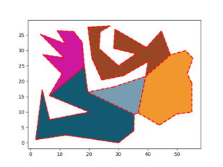
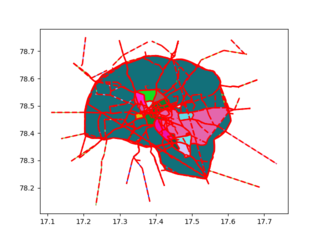

# DCEL - Doubly Connected Edge List

## Introduction

Doubly connected edge list (DCEL), which is also known as halfedge data structure, is used to 
efficiently represent planar graphs. Using a DCEL structure, we can easily manipulate the 
topological information of the planar graph such as vertices, faces and edges.

In general, a DCEL conatins a book-keeping record of all edges, vertices and faces of the graph. 
Each record individually can contain information of all it's incident geometric objects. 
We will look at how a DCEL stores this information in [Data Structure Approach](#data-structure-approach) 
section. 

## How to Run

The src folder contains the source code for the DCEL data structure. `g++` from the GNU
compiler suite is required to compile the program to a executable.

Steps to Compile:

1) `cd` into the src directory
2) Run `g++ main.cpp` which generates an executable called `a.out` in the same directory
3) Run the executable using `./a.out` (on linux) 
   1) The executable takes a dataset from command line argument. For example, to use an existing dataset, run `./a.out ../datasets/1sq.txt`
   2) If no command-line argument is given, it takes input from the shell directly (stdin)

## Input

The required input format for the algorithm to work correctly is:

- Input can be given both from file (via command-line args) or stdin
- First line must contain the no of Edges to be taken as input by the program.
- Each of next line must contain 4 integers, space seperated denoting the (x1, y1), (x2, y2) coordinates of endpoints of each edge.
- Each coordinate must be of integer type in the range -10^8 to 10^8.
- Number of coordinates must be less than 1 Billion.

## Output

Output of the algorithm prints all the HalfEdges incident to each face by traversing 
its representative half edges. All the faces outputed by the program can also be verified 
by running it through the plotting diagram.  
The last two lines of output show the time taken to take input in microseconds and the 
time taken by the algorithm to compute DCEL (also in microseconds).

An example of output of dataset [random4.txt](./datasets/random4.txt):

{ width=8cm height=8cm }\

## Documentation and Report

Documentation of this algorithm, functions and classes can be found in the `docs` folder 
in the current directory. Open the [index.html](../DCEL/docs/html/index.html) file from the docs 
directory with your preferred browser to go through the documentation

## Performance Analysis

This analysis does not include the time taken to show output on terminal. 
Analysis is performed with a system running:

- OS: Arch Linux (64Bit) running Linux Kernel version 5.7.2
- Processor: Intel Core i7 7700HQ
- RAM: 8GB
- Compiler: GNU G++ (GCC) 10.1.0

**The following observations are recorded:**

Manual generated test files:

| Filename     | Input Vertices  | Input Edges  | Input Faces  | File read time  | DCEL Creation Time |
|:-------------|:---------------:|:------------:|:------------:|:---------------:|:------------------:|
| 1sq.txt      | 4               | 4            | 2            | 505 microsec    | 27 microsec        |
| 4sq.txt      | 9               | 12           | 5            | 396 microsec    | 46 microsec        |
| random1.txt  | 10              | 12           | 4            | 257 microsec    | 52 microsec        |
| random3.txt  | 23              | 26           | 5            | 175 microsec    | 84 microsec        |
| random2.txt  | 23              | 37           | 16           | 192 microsec    | 102 microsec       |
| a.txt        | 31              | 33           | 4            | 150 microsec    | 109 microsec       |
| random4.txt  | 44              | 48           | 6            | 364 microsec    | 165 microsec       |
| house.txt    | 71              | 81           | 12           | 250 microsec    | 300 microsec       |

Using real world datasets:

- Road network of hyderabad, source: GPS coordinates filtered from osm(openstreetmap) data on hyderabad
  - hyd_1.txt: contains road network having tag of *highway* set as 'trunk'
  - hyd_2.txt: contains road network having tag of *highway* set as 'trunk' and 'primary'
  - hyd_2.txt: contains road network having tag of *highway* set as 'trunk', 'primary' and 'secondary'
  - hyd_2.txt: contains road network having tag of *highway* set as 'trunk', 'primary', 'secondary', and 'motorway'

| Filename     | Input Vertices  | Input Edges  | Input Faces  | File read time  | Algorithm runtime  |
|:-------------|:---------------:|:------------:|:------------:|:---------------:|:------------------:|
| hyd_1.txt    | 685             | 733          | 58           | 2.4 millisec    | 1.68 millisec      |
| hyd_2.txt    | 1787            | 1912         | 229          | 3.5 millisec    | 107.5 millisec     |
| hyd_3.txt    | 2959            | 3198         | 519          | 5.4 millisec    | 276.9 millisec     |
| hyd_4.txt    | 3612            | 3850         | 532          | 24.3 millisec   | 337.8 millisec     |

## Data Structure Approach

The following geometric objects are used in DCEL:

- **Vertex**: Object to store vertex coordinates and any one of its incident halfedges as its representative.
- **Edge**: Object to store its vertex endpoints.
- **Face**: Object to store a unique face-id and one of its incident halfedges as its representative
- **HalfEdge**: Object to store a directed halfedge which has pointers to all its incident geometric objects (Vertex, Face, next and previous halfedges and its twin halfedge)

This implementation uses a Hash Map to store list of all incident halfedges for each vertex. This 
Hash Map uses vertex pointer as key and stores a list of halfedges as value. Our DCEL also has a 
list of Vertices and Faces which can be used to iterate through all Vertices and Faces quickly.

A half-edge has a pointer to the next half-edge and previous half-edge of the same face. Each 
half-edge has a single face as its representative Face (which is present towards left side of it). 
All half-edges associated with a face are counter-clockwise which can be obtained by traversing its 
representative Halfedge. To reach the other face, we can go to the twin of the half-edge and then 
traverse the other face. Each half-edge also has a pointer to its origin vertex which can be used to 
get all the Vertex points of the corresponding face.

## Results

This algorithm to construct a DCEL takes time complexity of O(V+E). From the 
analysis of example dataset runtimes, we can easily see that increase in number 
of vertices and edges directly leads to increase in DCEL construction time. 

{ width=8cm height=8cm }\

The output of the algorithm is direct traversal of representative edges of all
faces present in the input. In the above example of Hyderabad road network dataset, 
it shows all the faces bounded by the roads. All faces might not be visible 
directly as the road system branches without forming many faces. But as we zoom,
the faces can be spotted between roads. 

## Conclusion

The time complexity O(V+E) cannot be reduced further because to store the graph,
it is required to traverse through all Vertices and Edges present in the graph.
Although the current implementation only supports connected graphs, it can also be 
extended to store disconnected components using techniques like hidden vertices. 

From the above results, we can be sure that DCEL can be a good candidate data 
structure for easy representation of planar graphs. But as every other data structure,
even DCEL has it downfalls. The main one being the amount of Storage required to store. 
The storage requirement can be further reduced if we only need to store Vertices or 
Edges, but this does not give huge improvements. Also, as the size of DCEL increases,
the time to add an extra edge increases in a linear fashion which might be bad based 
on the application.DCEL is a simple data structure which helps to easily manupulate 
the graph structre, but it might not be an appropriate choice for low memory 
applications such as in embedded systems.