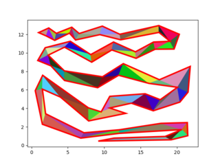
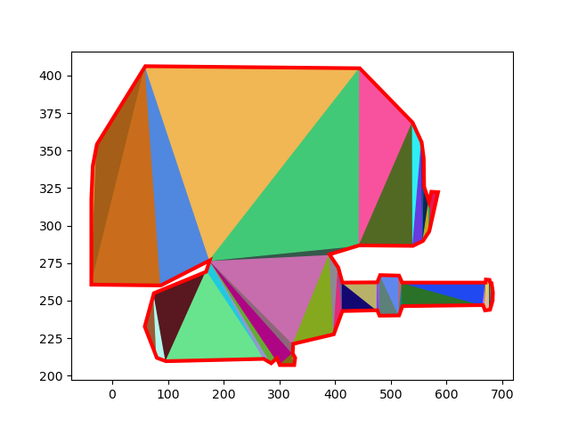

# Polygon Triangulation

## Introduction

The decomposition of a polygon into triangles whose union again results in the original
polygon is called polygon triangulation. In the method, no new Vertices are added. Only
the diagonals of the polygon results in the triangulation. There need not be a unique
triangulation for a given polygon.

There are various methods which can be used to perform polygon triangulation. In our 
implementation, we [discuss](#algorithm-approach) two types of triangulation which are: 
1) Ear Clipping Triangulation. 
2) Plane sweep monotone division combined with Monotone triangulation.

## How to Run

The src folder contains the source code for the convex hull program. `g++` from the GNU
compiler suite is required to compile the program to a executable.

Steps to Compile:

1) `cd` into the src directory
2) Run `g++ main.cpp` which generates an executable called `a.out` in the same directory
3) Run the executable using `./a.out` (on linux) 
   1) The executable takes a dataset from command line argument. For example, to use an existing dataset, run `./a.out ../datasets/complex.txt`
   2) If no command-line argument is given, it takes input from the shell directly (stdin)

## Input

The required file format for the algorithm to work correctly is:

- The input **must** be a clockwise ordering of Poins present on the polygon.
- First line must contain the no of Points to be taken as input by the program.
- Each of next line must contain 2 integers, space seperated denoting the (x, y) coordinates of each point.
- Each coordinate must be of integer type in the range -10^8 to 10^8.
- No of coordinates must be less than 1 Billion.

## Output

Each line of output contains three coordinates of points present on each triangulation.  
The last two lines of output show the time taken to take input in microseconds and the 
time taken by the algorithm to compute Triangulation (also in microseconds).

This is the output of one of the datasets [long.txt](./datasets/long.txt)

{ width=8cm height=8cm }\

## Documentation and Report

Documentation of this algorithm, functions and classes can be found in the `docs` folder 
in the current directory. Open the [index.html](../Triangulation/docs/html/index.html) file from the 
docs directory with your preferred browser to go through the documentation

## Performance Analysis

Analysis is performed with a system running (does not include printing time):

- OS: Arch Linux (64Bit) running Linux Kernel version 5.7.2
- Processor: Intel Core i7 7700HQ
- RAM: 8GB
- Compiler: GNU G++ (GCC) 10.1.0

**The following observations are recorded:**

Time taken to triangulate basic shapes:

| Filename | Input Vertices | Computed Triangles | Line Sweep Triangulation Runtime | Ear Clipping Triangulation Runtime |
|:---------|:--------------:|:------------------:|:--------------------------------:|:----------------------------------:|
| triangle.txt       | 3      | 1      | 30 microsec  | 16 microsec  |
| downConvex.txt     | 6      | 4      | 43 microsec  | 23 microsec  |
| test.txt           | 6      | 4      | 35 microsec  | 24 microsec  |
| square.txt         | 4      | 2      | 36 microsec  | 18 microsec  |
| hexagon.txt        | 6      | 4      | 38 microsec  | 16 microsec  |
| monotone.txt       | 15     | 13     | 109 microsec | 75 microsec  |
| uniMonotone.txt    | 8      | 6      | 115 microsec | 42 microsec  |
| complex.txt        | 17     | 15     | 188 microsec | 17 microsec  |
| strange.txt        | 16     | 14     | 148 microsec | 122 microsec |
| star.txt           | 10     | 8      | 159 microsec | 101 microsec |
| spiral.txt         | 32     | 30     | 278 microsec | 214 microsec |
| tank.txt           | 55     | 53     | 429 microsec | 452 microsec |
| long.txt           | 72     | 70     | 593 microsec | 1668 microsec|

## Algorithm Approach

### Ear Clipping

According to the two ears theorem, any simple polygon with minimum of 4 
vertices without holes has atleast two "ears". An Ear is defined at the 
vertex where internal angle is less than PI and the line joining the adjacent
vertices is a diagonal of the polygon. 

The algorithm works by removing away these "ears" (which are triangles) until 
the complete polygon is triangulated. This algorithm is easy to implement, but 
slower than some other algorithms, and it only works on polygons without holes.
The runtime complexity of this algorithm is O(n^2^)

### Plane Sweep Monotone Triangulation

A monotone polygon can be easily triangulated in O(n) complexity. A simple polygon 
is said to be monotone w.r.t a line L only if any line perpendicular to L passes 
through the polygon at most twice. Any monotone polygon can be divided into two 
monotone chains. A polygon that is monotone w.r.t the x-axis is called x-monotone. 
Given x-monotone polygon, the greedy algorithm begins by walking on one chain of 
the polygon from top to bottom while adding diagonals (forming triangles) whenever 
it is possible. 

If a polygon is not monotone, it can be partitioned into monotone sub polygons 
in O(n log n) time using line/plane sweep method. Generally, this algorithm can 
triangulate a planar subdivision with in O(n log n) time using O(n) space.

## Results

{ width=8cm height=8cm }\

In the above image, the red boundary represents the input given to the algorithm
and the random colored triangle represent the output given by the program.

It can be observed from the examples that increase in number of vertices affects 
the runtime of ear clipping triangulation more than the plane sweep monotone 
triangulation. From the results of the above datasets, we can see that 
for just an increase of vertices from 50 to 70 causes the ear clipping algorithm 
to triple its triangulation time.

## Conclusion

From the above comparisions, we can see that ear clipping algorithm, even after 
being a simple algorithm, due it is asymptotic complexity being O(n^2^), it 
surely is not recomended for applications where number of vertices go beyond 
70 (which almost always happens).

If we know that the input only has a monotone polygon, it is even more easier 
and faster to triangulate it in just O(n). The main plane sweep algorithm tries 
to use this to its advantage by dividing the polygon first into monotones.